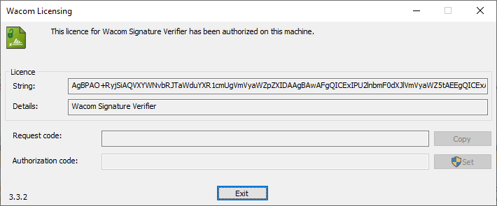
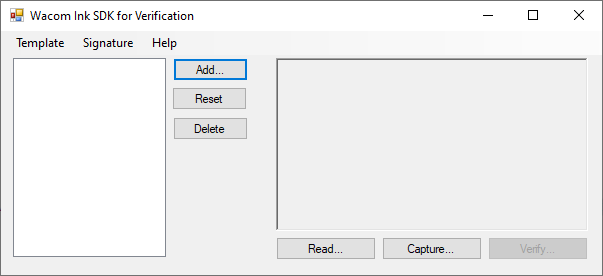
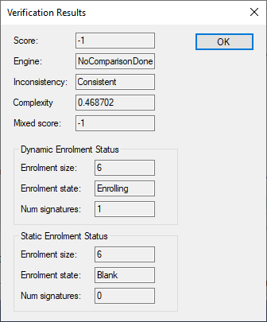
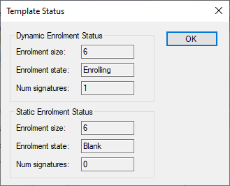
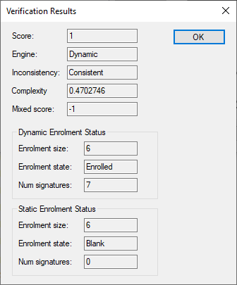
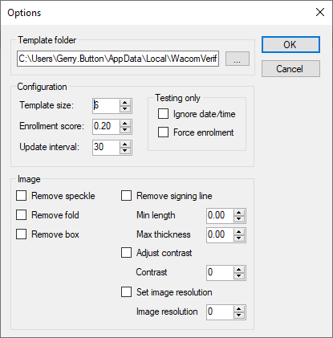

# Getting Started 

## Development Environment

The sample application is supplied for Windows 7 and above to demonstrate using the SDK.


## Install the SDK

Run the MSI installer included in the SDK folder to install the necessary Wacom signature and Verification components.

## License the application
A license is required to run the Verification application.  
The license is unique to the machine running the SDK and requires use of the Licenser application found in the Windows Start menu:

```
Start..License Signature Verification
```

The Licenser displays a dialog:



A request code will be displayed in the dialog.  
Use the Copy button and email the code with subject **Wacom Ink Verification Beta - Authorisation code** to:  
 *signature-support@wacom.com*

You will then be emailed an authorisation code to paste into the dialog, for example:
```
Request code:       AgEZMFgfYAQXBgAMKbDlBA9TaWduYXR1cmVWZXJpZnk
Authorization code: AgEji3UNEgQhD1NpZ25hdHVyZVZlcmlmeRBrm9/PHfIfgIODLHOWA+O3
```

----
## Sample Code

The sample C# application is provided to assist with new development.

The following steps describe how to build and run the application:

* Ensure that .NET Framework 4.7.2 is installed for a successful build.
* Open the sample solution **WacomInkVerificationSample.sln** in Visual Studio 2019.
* set the project to build as **x86**
* build and run the application

The application displays its main dialog:



To use the application follow the steps:

* Select Add - add a new Template using a conventional filename
* Select the template in the dialog
* Select Capture to capture a signature from your device
* Select Verify to enroll the signature in the selected template - a dialog will report the enrollment status:



At any time the template status can be viewed using the menu option **Template...Status**



Once the sufficient number of signatures have been enrolled in a template, comparison results can be obtained:



### Options

The menu option **Template...Options** provides options for configuring the template:



### Read

Use the **Read** button or **Signature...Read file** to read a file into the signature area.
>  File **Drag and Drop** is also supported.

The file used for input can be one of the following types:

* Encoded signature image - the signature data is extracted from the signature image and treated in the same way as a live captured dynamic signature
* Unencoded signature image - the image is treated as a static signature image
* Scanned or imported signature image - the image is treated as a static signature image

### Verify

Depending on the status of the template the signature captured or read into the signature area is either used to enroll or verify the signature.

### SDK for Verification API

To view the API in parallel with the sample application select the option:
```
Start...Wacom Ink SDK for Verification...SDK Reference
```
The API is documented in the set of doxygen files.


### Troubleshooting

#### License

A license must be configured to use the application.

#### Threads

The time taken to enroll and verify signatures is significantly affected by the number of threads available. This is particularly evident in default Virtual Machines.
**Threads.exe** supplied in SDK\Utils reports the number of threads available. The value reported should be greater than 2.


----
----


