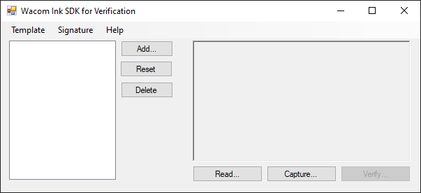
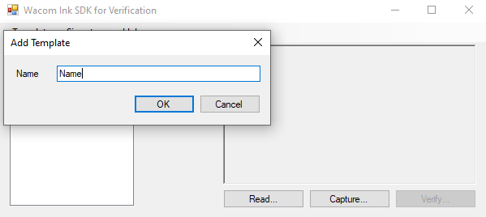
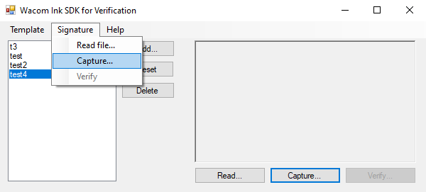
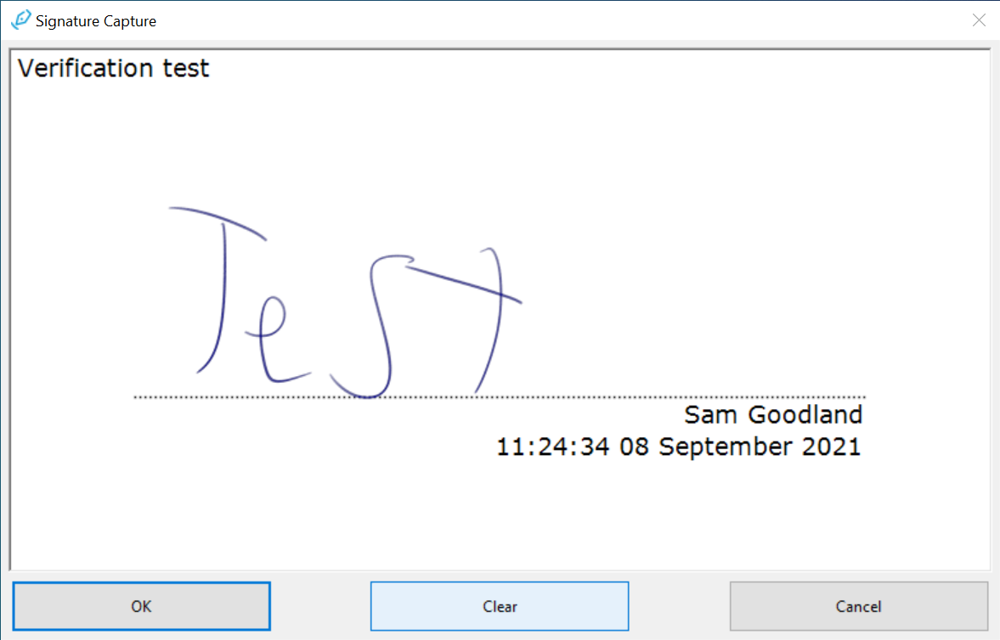
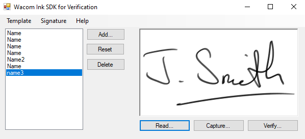
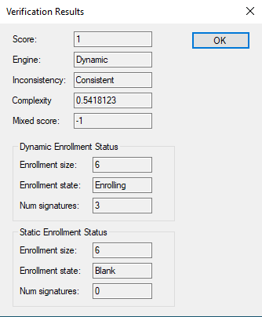
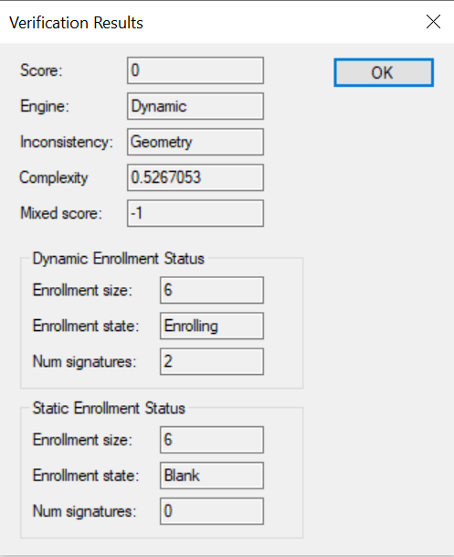
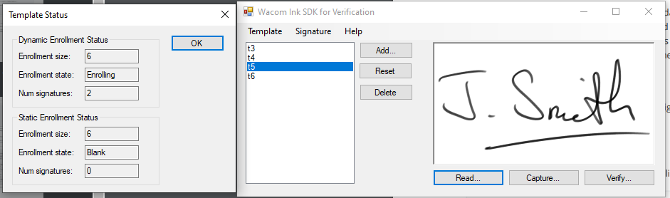

# Wacom GSV client-server sample - Windows

# Introduction

This repository contains the GSV sample server and client applications. Before you build the server you should edit the ```GSV-Server-Client/Api/gsv_options.json``` file and update the ```TemplateFolder``` to point to a data directory on your server, e.g.:
```
{
  "TemplateFolder": "C:\\WacomVerification",
  "ConfigurationOptions": {
    "TemplateSize": 6,
    "EnrollmentScore": 0.2,
    "UpdateInterval": 30,
    "SignatureStyle": 0,
    "IgnoreDateTime": false,
    "ForceEnrollment": false
  },
  "ImageOptions": {
    "RemoveSpeckle": false,
    "RemoveFold": false,
    "RemoveBox": false,
    "RemoveSigningLine": false,
    "MinSigningLineLength": 0.0,
    "MaxSigningLineThickness": 0.0,
    "AdjustContrast": false,
    "Contrast": 0,
    "SetImageResolution": false,
    "ImageResolution": 0
  }
}
```

# Project Layout

Before you build the sample, you will need to install the GSV SDK on the build machine. After the engine is installed, open the project solution file under ```GSV-Server-Client/GSV-Server-Client.sln.```

The solution consists of 2 client-side components and 2 server-side components

## Client-side

### GsvClient

This is included inside the server as a dependency.

#### Models

In Models, we have the web requests. We can see there's requests and responses. 

Essentially we send an HTTP request and receive a response back. Within Request and Response you can see the various CRUD (creating, reading. updating and deleting) requests and the responses to them. 

It will not be necessary for the client (end user) to connect to the GsvClient component. To facilitate this, these sections were duplicated. This way, it's abstracted out of the underlying comp component.  

- Requests: Contains various requests for CRUD functionality. 
- Responses: Responses to the GET (Read) requests. 


#### Gsv Client Framework

The Gsv Client Framework contains the interfaces used for server communication. 

- GsvClientBase
- GsvClientConfiguration - Handles client configuration for the GSV.
- GsvClient - A basic web interface for signature verification. 

### WacomInkVerificationSample

This is the UI Application that integrates the client framework. More details can be found in "Breakdown of features".

## Server-side

### GsvPersistence

The GsvPersistence is the framework that is used to configure the persistence layer on the server. It currently uses a SQLite DB for demo and its notable components are:

#### DataModels

- TemplateDataModel: The Template data model is the B64 string of the template, the name of the template and the client (end user) who created it. It's illustrates whether or not a database is in operation. 
- ClientDataModel: Client is effectively whoever is logging into the server. This will contain session data and authentication. 

### GsvServer

This is the worker component that uses the GSV engine to perform verification requests.

#### Controllers

In Controllers, we use a microservice framework. 

The most important files for the framework are:

- TemplateController - the controller that handles GSV templates.
- ClientController - the controller that handles GSV authentication and authorization. 
- VerificationController - the controller that handles GSV signatures. 

These are the 3 primary files roles that interact. Additionally, GsvSignatureEngineService is the worker designed to handle signature verification. 


# How to license 

After obtaining a verification license, insert it into GSV-Server-Client\GsvServer\appsettings.json. A temporary evaluation license can be found in the Verification SDK for Windows start guide.

After obtaining a signature capture license, insert it into WacomInkVerificationSample\SampleLicense.txt. 

# How to run

## Building the sample

After setting the configuration files to match your system layout, select the API project and select ```Debug->Start without debugging``` to start the server component on the system. Once this has built, the server will run and the API documentation can be viewed using the local swagger implementation:

https://localhost:5001/swagger/index.html

You can now build the client app by selecting the WacomInkVerificationSample target in the solution and selecting the debug option. This will allow you to create a new template, capture or load signatures and send the verification requests to the local running GSV server.

All com calls were replaced with http calls. All the interesting work is now being handled over http over a separate server. When we begun it it's local but we could throw it on a server and work on it remotely. 


## Breakdown of features

Upon startup, the following window will appear. 



### Add

To add a template, either pressing the Add button or, in the dropdown menu, clicking Template → Add... creates a prompt to add a template.



Note that names for templates are not unique. 

### Capture

Pressing the Capture button will capture a signature from your device. This can be done by pressing Capture... or by going to the dropdown Signature → Capture...

NB: Selecting a template on the left-hand side while pressing Capture... will save that signature to the template. 



Pressing Capture... will yield this signature signing window. 

You may then from there sign within the box, with options to clear if a mistake is made, an option to accept the signature and an option to cancel.



If the OK option is selected and the signature accepted, it will then appear back in the main sample window. 


### Read

Selecting the Read... option will allow selection of an previously captured signature to work with. 

The signature will then be displayed in the main sample window. 



### Verify

Pressing the Verify... button or going to Signature → Verify will verify the signature and yield its results. 



Within the results is contained data on the consistency of the signature. 



If an inconsistency is found, it will give a reason (such as above, where it gives the reason as geometry, meaning the shapes do not match). 

### Reset

To reset a signature held in a template, press the "Reset" button. 

This will have reset any value held in the selected template. 

### Delete

To delete a template, highlight the template you wish to delete, press "Delete", and this will remove the template in question. 


### Status

Pressing the Status button while highlighting the desired template will show the status of the signature. 




### Options

The menu option **Template...Options** provides options for configuring the template:
